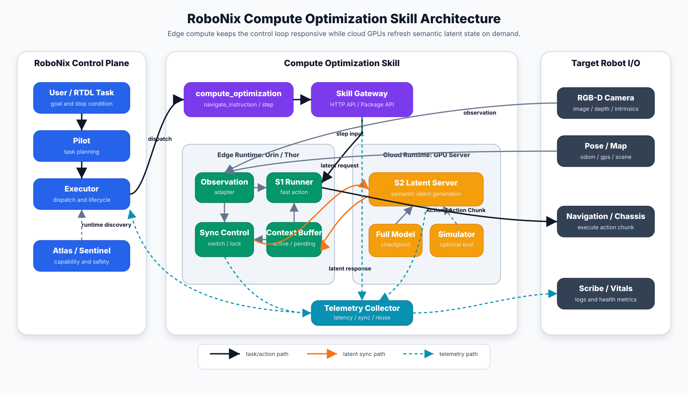
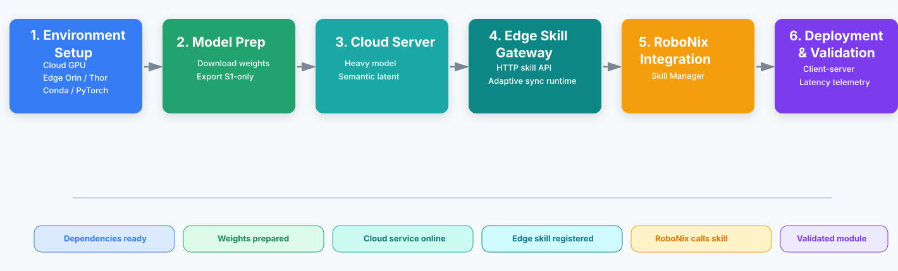

<div align="center">

# RoboNix Compute Optimization Skill

**Adaptive compute orchestration for low-latency dual-system vision-language navigation**

[](https://github.com/i6bimua/RoboNix-Compute-Optimization-Skill/actions/workflows/ci.yml)
[](pyproject.toml)
[](LICENSE)
[](docs/supported-models.md)

[English](README.md) | [简体中文](README.zh-CN.md)

</div>

RoboNix Compute Optimization Skill accelerates dual-system VLN inference by
placing slow semantic reasoning on a cloud GPU and low-latency action generation
on an edge device. It combines asynchronous execution, key-latent-aware
synchronization, cached-context reuse, and adaptive timeout handling.

The project is a standalone compute runtime with an external HTTP Skill
boundary. It does not modify RoboNix core or claim an in-tree RoboNix Driver.

## Benchmark Highlights


On the complete R2R-CE `val-unseen` split with InternVLA-N1 DualVLN:

- **2.22× speedup over Edge Only** on Orin+A100
  (`497.8 ms → 224.4 ms`);
- **+6.1 SR points and +12.7 SPL points over Naive ECC**
  (`SR 56.7→62.8`, `SPL 45.1→57.8`);
- **0.60 GB edge memory** for split inference, compared with 16.63 GB for
  Edge Only;
- **less than 8 KB orchestration overhead** for the pending context and
  control state.

The benchmark covers 1,839 episodes with the original DualVLN weights, NVIDIA
A100 cloud compute, and Orin/Thor edge devices in `MAX_N`. See
[R2R-CE Benchmark](benchmarks/r2r_ce/README.md) for all baselines, Thor results,
metadata, and reproduction entry points.

## Supported Models and Platforms

| Component | Status | Validated Scope |
| --- | --- | --- |
| InternVLA-N1 DualVLN | End-to-end validated | S2 cloud reasoning + S1 edge action generation |
| Mock S1/S2 backend | CI validated | Protocol, synchronization, timeout, and telemetry |
| Generic dual-system runner contract | Adapter API | Requires model-specific integration and benchmark evidence |
| Cloud device | Validated | NVIDIA A100 |
| Edge devices | Validated | NVIDIA AGX Jetson Orin and Thor |
| Simulator | Validated | Habitat / VLN-CE, R2R-CE |

OpenVLA, π0, and other VLA families are not listed as supported models. A model
enters the validated list only after its adapter, smoke test, run instructions,
and benchmark metadata are available. See
[Supported Models](docs/supported-models.md).

## What the Skill Optimizes

1. **Asynchronous execution** — S1 continues the control loop while S2 computes
   a semantic latent in the background.
2. **Key-latent synchronization** — high-value steps can request a fresh latent
   instead of using a fixed synchronization period.
3. **Adaptive missing handling** — timeout prediction, latent reuse, and late
   response absorption avoid unbounded network blocking.
4. **Measured operation** — per-step telemetry records S1/S2 latency, sync
   events, timeout decisions, reuse, payload size, and navigation metrics.

## Architecture



The current backend implements a cloud S2 service, an edge-owned S1 control
loop, an active/pending context buffer, and a telemetry path. “Cloud-edge” is
the compute placement used by this backend; it is not the product name.

## Target RoboNix Workflow



The diagram shows the target RoboNix integration path. The repository provides
the compute runtime, evaluation tools, and an HTTP Skill boundary that can be
connected to RoboNix orchestration without embedding model logic in the core.

## Three-Minute Quick Start

The mock path requires no model weights, simulator assets, or GPU:

```bash
git clone https://github.com/i6bimua/RoboNix-Compute-Optimization-Skill.git
cd RoboNix-Compute-Optimization-Skill

conda create -n robonix-compute python=3.10 -y
conda activate robonix-compute
python -m pip install -U pip
python -m pip install -e ".[dev,websocket]"

bash scripts/run_mock_compute.sh --steps 5
```

Expected output:

```text
outputs/mock_compute/telemetry.json
```

Run the cloud and edge mock processes separately:

```bash
# Terminal 1
robonix-compute-cloud --mode mock --host 0.0.0.0 --port 8765

# Terminal 2
robonix-compute-edge \
  --mode mock \
  --cloud-host 127.0.0.1 \
  --cloud-port 8765 \
  --steps 5
```

## Real Model Path

Download the validated model and prepare the S1-only edge checkpoint:

```bash
robonix-compute-download --output checkpoints

export INTERNNAV_ROOT=<path-to-InternNav>
export PYTHONPATH="$INTERNNAV_ROOT:$INTERNNAV_ROOT/third_party/diffusion-policy:${PYTHONPATH:-}"

robonix-compute-export-s1 \
  --source checkpoints/InternVLA-N1 \
  --output checkpoints/InternVLA-N1-S1
```

Set the runtime paths:

```bash
export ROBONIX_COMPUTE_MODEL_DIR="$(pwd)/checkpoints/InternVLA-N1"
export ROBONIX_COMPUTE_S1_MODEL_DIR="$(pwd)/checkpoints/InternVLA-N1-S1"
export ROBONIX_COMPUTE_DATA_ROOT=<path-to-vln-data>
```

Run the strict preflight before real inference or evaluation:

```bash
robonix-compute-preflight \
  --internnav-root "$INTERNNAV_ROOT" \
  --data-root "$ROBONIX_COMPUTE_DATA_ROOT" \
  --checkpoint-path "$ROBONIX_COMPUTE_MODEL_DIR" \
  --s1-model-path "$ROBONIX_COMPUTE_S1_MODEL_DIR" \
  --strict
```

The complete cloud, edge, Habitat, model, and data commands are in:

- [Installation](docs/installation.md)
- [Quick Start and Deployment](docs/quickstart.md)
- [Benchmark Reproduction](docs/benchmarks.md)
- [Troubleshooting](docs/troubleshooting.md)

## HTTP Skill Boundary

Start the optional service wrapper:

```bash
robonix-compute-skill \
  --host 0.0.0.0 \
  --port 8090 \
  --config-json examples/robonix_compute_config.json
```

```bash
curl http://127.0.0.1:8090/health

curl -X POST http://127.0.0.1:8090/step \
  -H 'Content-Type: application/json' \
  -d '{"observation":{"rgb":[1.0,0.0],"depth":[0.0]}}'
```

The wrapper exposes `health`, `setup`, `reset`, `step`, `telemetry`, and `close`
operations. See [Architecture and Integration](docs/architecture.md) for the
boundary and current status.

## Repository Layout

```text
RoboNix-Compute-Optimization-Skill/
├── robonix_compute/            # Runtime, protocols, adapters, CLI and Skill API
├── benchmarks/r2r_ce/          # Structured results and reproduction metadata
├── configs/                    # Default, cloud, edge and Habitat configurations
├── docs/                       # Installation, model, architecture and benchmark guides
├── examples/                   # Mock and InternNav configuration examples
├── scripts/                    # Launch, summary and release-audit helpers
└── tests/                      # Unit and integration tests
```

Weights, datasets, raw experiment logs, and private paths are not distributed
with this source repository.

## Validation

```bash
python -m pytest -q
python scripts/release_audit.py
python -m build
```

Lightweight tests run in GitHub Actions. GPU, InternNav, Habitat, and licensed
dataset tests remain explicit local or self-hosted validation steps.

## Documentation

- [Installation](docs/installation.md)
- [Quick Start and Deployment](docs/quickstart.md)
- [Supported Models](docs/supported-models.md)
- [Architecture and RoboNix Boundary](docs/architecture.md)
- [Benchmarks](docs/benchmarks.md)
- [Troubleshooting](docs/troubleshooting.md)
- [Contributing](CONTRIBUTING.md)
- [Changelog](CHANGELOG.md)

## Citation

If this software supports your research, cite the repository metadata in
[`CITATION.cff`](CITATION.cff). The benchmark implementation is based on
InternNav/InternVLA-N1 DualVLN and should be cited according to their upstream
license and attribution requirements.

## License

This project is licensed under the
[Mulan Permissive Software License, Version 2](LICENSE). Third-party models,
simulators, datasets, and libraries retain their own licenses; see
[THIRD_PARTY_LICENSES.md](THIRD_PARTY_LICENSES.md).
