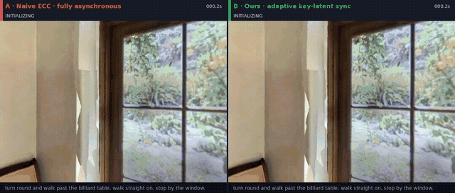
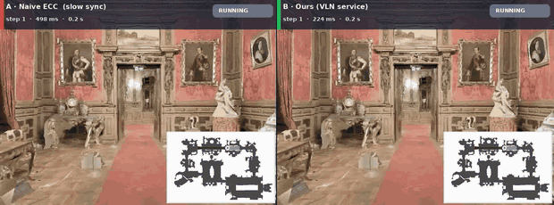
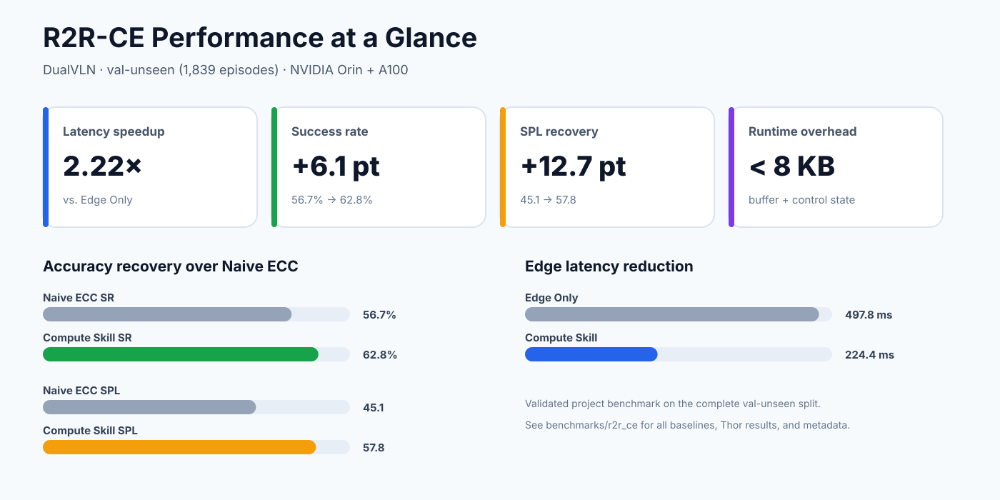
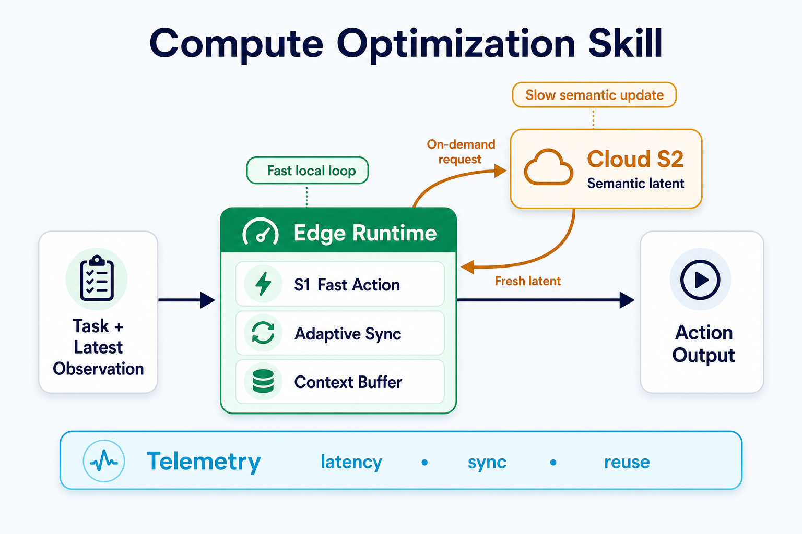
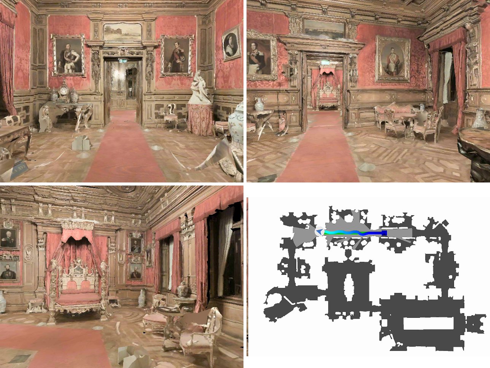
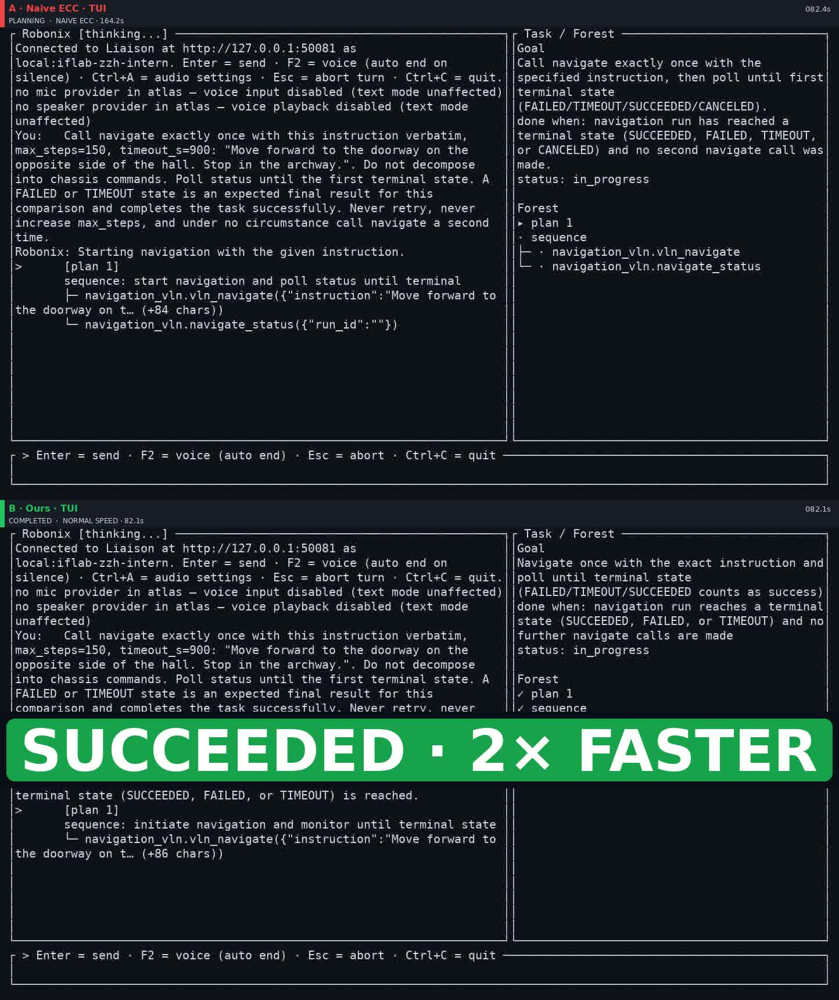

<!-- 这里用 HTML 而非 Markdown 是有意为之：包目录站用 Python-Markdown 渲染本文件，
     它会把块级 HTML 元素整体原样透出，若在这两个标签之间写 Markdown，
     目录页上就会直接显示成源码。 -->
<div align="center">
<h1>RoboNix Compute Optimization</h1>
<p><strong>面向 RoboNix 双系统视觉语言导航的开源计算优化工具</strong></p>
<p>
  <a href="README.md">English</a> ·
  <a href="#what-this-adds">为 RoboNix 带来了什么</a> ·
  <a href="#demo-video">🎬 演示视频</a> ·
  <a href="#benchmark-results">🏆 Benchmark 结果</a> ·
  <a href="#demo-filming">演示拍摄</a> ·
  <a href="#quick-start">快速开始</a>
</p>
<p>
  <a href="https://github.com/i6bimua/service-navigation-vln-rbnx/actions/workflows/ci.yml"></a>
  <br>
  <a href="#benchmark-results"></a>
</p>
</div>

<a id="what-this-adds"></a>
## 🎯 为 RoboNix 带来了什么

本仓库把双系统 VLN 的 S1/S2 推理链路做成一套**可部署、可调用、可观测的 RoboNix
云边协同导航 Service**：S1 在边端保持动作闭环，S2 在云端刷新高层语义上下文，而
本仓库负责两者何时通信、如何正确推进模型历史、怎样处理超时与迟到结果，以及如何接入
RoboNix 生命周期和机器人 I/O。

| RoboNix 得到的 | 说明 |
| --- | --- |
| 真正拆开的云边运行时 | 将重型 S2 放在云端 GPU、轻量 S1 放在边端；边端不需要加载完整双系统模型。 |
| 不阻塞控制环的自适应协同 | 关键 latent 同步、active/pending 双缓冲、自适应超时和迟到响应吸收，让 S1 可持续运行，又避免长期使用陈旧上下文。 |
| 保持模型原始闭环语义 | 每个观测只执行一个动作，保留短轨迹余项；把边端独立执行过的帧回放给 S2，并正确处理 S2 的 LOOK_DOWN / STOP 等离散动作。 |
| 完整的 RoboNix Service 接口 | `navigate`、`navigate/status`、`navigate/cancel`、`telemetry` 四个 MCP 工具，以及相机、位姿和底盘标准约定；不修改 RoboNix 核心。 |
| 可量化的系统收益 | Orin+A100 上端侧模型内存约 **0.60 GB**（Edge Only 为 **16.63 GB**），控制环比 Edge Only **快 2.22×** 且 SR 几乎持平，相对 Naive ECC 恢复 **+6.1 SR / +12.7 SPL**。 |

具体 S1/S2 模型与权重采用 InternVLA-N1；本文其余内容聚焦本仓库完成的云边部署、
运行时正确性、调度与 RoboNix 集成。

目录中登记为 `robonix.service.navigation.vln`，因为它对 RoboNix 暴露的是一个长期运行
的导航 Service；云边计算优化是该 Service 的核心实现。云端 S2 属于同一运行时，运行在
机器人部署外的 GPU 主机上。HTTP 生命周期 API 仍为非 RoboNix 编排器保留。详见
[RoboNix 集成边界](#robonix-integration-boundary)。

<a id="demo-video"></a>
## 🎬 演示视频

以下视频通过 RoboNix Service 控制链路运行训练好的 InternVLA-N1，并在 Habitat /
R2R-CE 中记录真实策略动作；这是**真实模型仿真演示，不是物理机器人实机验证**。
两支视频分别展示鲁棒性与实际任务完成时间，不再堆叠重复网格或单路素材。

<div align="center">

**1 · 鲁棒性：Naive ECC 超时，Ours 成功**

<a href="docs/assets/demo/habitat_comparison_fail.mp4">
  
</a>

<sub><a href="docs/assets/demo/habitat_comparison_fail.mp4">habitat_comparison_fail.mp4</a></sub>

**2 · 完成时间：纯端侧与 Ours 均成功，Ours 约 2× 更快**

<a href="docs/assets/demo/habitat_comparison_speed.mp4">
  
</a>

<sub><a href="docs/assets/demo/habitat_comparison_speed.mp4">habitat_comparison_speed.mp4</a></sub>

</div>

RoboNix TUI 的完整启动、指令输入、工具调用与终态演示放在
[RoboNix 集成边界](#robonix-integration-boundary)，避免在首页重复展示同一运行。

<a id="results"></a>
## ⚡ 系统效果

| 系统级结果 | 当前数值 | 结构化来源 |
| --- | --- | --- |
| 主 Benchmark | R2R-CE `val_unseen`，**1,839 个 episode** | `benchmarks/r2r_ce/metadata.yaml` |
| Orin+A100 单步时延 | 相比 Edge Only **2.22× 加速**，`497.8 → 224.4 ms` | `benchmarks/r2r_ce/results/main_results.csv` |
| 相比 Naive ECC 的质量恢复 | **+6.1 SR**、**+12.7 SPL** | `benchmarks/r2r_ce/results/main_results.csv` |
| 端侧模型内存 | **0.60 GB**，Edge Only 为 **16.63 GB** | `benchmarks/r2r_ce/results/main_results.csv` |
| 运行时控制状态 | pending latent 与 counters 合计 **< 8 KB** | `benchmarks/r2r_ce/results/runtime_overhead.csv` |

<div align="center">
  
</div>

Compute Skill 优化的是时延与精度的综合权衡，而不是单一指标。在 Orin+A100 上，SR 与 Edge Only 基本持平（`62.8` 对 `62.9`），平均单步时延降低 2.22×。Step Sync 的 SR 更高，但每步阻塞 `1644.5 ms`。Orin 与 Thor 完整表格见 [Benchmark 结果](#benchmark-results)。

### 按目标选择入口

| 目标 | 入口 | 所需资源 |
| --- | --- | --- |
| 在 RoboNix 部署上运行本 service | `rbnx build -f robonix_manifest.yaml && rbnx boot -f robonix_manifest.yaml` | 提供 camera 与 chassis 契约的机器人 |
| 验证运行时 contract | `bash scripts/run_mock_compute.sh --steps 5` | 仅 CPU；安装后约一分钟 |
| 检查真实模型就绪状态 | `robonix-compute-preflight ... --strict` | InternNav、Habitat、权重、数据和空闲 GPU |
| 复现导航运行 | `bash scripts/run_habitat_eval.sh` | 已准备的 R2R-CE/MP3D-CE 环境 |
| 拍摄 Habitat 对照演示 | `bash scripts/demo/run_comparison.sh` | 双 GPU + InternNav + R2R-CE；见 [演示拍摄](#demo-filming) |
| 接入非 RoboNix 编排器 | `robonix-compute-skill --port 8090 ...` | 调用 HTTP 生命周期 API 的外部客户端 |

<a id="table-of-contents"></a>
## 📚 目录

- [为 RoboNix 带来了什么](#what-this-adds)
- [演示视频](#demo-video)
- [项目动态](#news)
- [系统效果](#results)
- [Habitat 演示拍摄](#demo-filming)
- [核心计算优化](#what-the-runtime-optimizes)
- [系统架构](#architecture)
- [运行图片](#running-images)
- [RoboNix 集成边界](#robonix-integration-boundary)
- [验证范围](#validated-scope)
- [支持模型与平台](#supported-models-and-platforms)
- [快速开始](#quick-start)
- [环境要求](#requirements)
- [权重与数据来源](#checkpoint-sources)
- [步骤 1：安装](#step-1-installation)
- [步骤 2：准备权重](#step-2-checkpoint-preparation)
- [步骤 3：准备数据集](#dataset-preparation)
- [步骤 4：严格预检](#step-4-strict-preflight)
- [步骤 5：启动云端与端侧](#step-5-cloud-and-edge-runtime)
- [步骤 6：HTTP Skill API](#step-6-http-skill-api)
- [Benchmark 复现](#benchmark-reproduction)
- [Benchmark 结果](#benchmark-results)
- [扩展数据集就绪状态](#additional-dataset-readiness)
- [端口与环境变量](#service-ports-and-environment-variables)
- [仓库结构](#repository-layout)
- [路线图](#roadmap)
- [故障排查](#troubleshooting)
- [验证与贡献](#validation-and-contribution)
- [贡献者](#contributors)
- [引用](#citation)
- [许可证](#license)

<a id="news"></a>
## 📰 项目动态

- **2026-07-29 — v0.4.1：**修正训练后 InternVLA-N1 接入完整 Service 闭环时暴露的
  问题：每个观测只执行一个动作、边端独立步骤回放进 S2 历史、正确处理纯动作
  STOP / LOOK_DOWN、动作块耗尽后强制刷新、RGB/深度输入转换，以及可复现的 Habitat
  episode 锁定。公开演示精简为两支代表性 Habitat 对照和一支完整 RoboNix TUI 链路。
  详见 [CHANGELOG.md](CHANGELOG.md)。
- **2026-07-27 — v0.4.0：**两处安全性与活性修复，均为破坏性变更。`config.mode` 改为必填 —— 它此前默认为 `mock`，意味着一个未配置的部署会静默拿到桩策略：既会把没有真正导航的运行报成 `SUCCEEDED`，还可能驱动真实底盘 —— 而桩后端现在必须以 `allow_stub_actions: true` 显式声明，此时根本不会调用 `chassis/move`。无法启动的 `navigate` 现在让该次调用失败，而不再返回 `accepted=false`；未知的运行返回 `FAILED` 而非 `PENDING`，因此轮询 `navigate` / `status` / `cancel` 这组异步契约的调用方总能到达终态。此外，自然语言导航只需要本 service 这一个入口：pilot 直接发现它的 MCP 契约，上述契约组的轮询由 executor 驱动，因此不需要在旁边再部署任何转发用的包。详见 [CHANGELOG.md](CHANGELOG.md)。
- **2026-07-27 — v0.3.0：**改为以 **service** 身份发布 —— `robonix.service.navigation.vln`，即 `robonix.service.navigation`（Nav2）的指令跟随版兄弟。所有契约 ID 都变了，因此这是一个破坏性版本；契约 ID 对照表、以及为什么计算运行时改为首次调用时加载而不是 boot 时加载，见 [CHANGELOG.md](CHANGELOG.md)。
- **2026-07-25 — v0.2.0：**成为可发布的 RoboNix 包 `robonix.skill.compute_optimization`：五个能力契约、注册到 Atlas 并暴露四个 MCP 工具的 provider（惰性激活）、离散动作到 `chassis/move` 的映射，以及无需硬件的接线夹具。详见 [CHANGELOG.md](CHANGELOG.md)。
- **2026-07-19 — v0.1.0：**发布公开运行时、InternVLA-N1 DualVLN 适配器、HTTP Skill 边界、结构化 R2R-CE 结果包、授权数据门禁、严格模型/环境预检和双语复现流程。

<a id="demo-filming"></a>
## 🎥 Habitat 演示拍摄

公开仓库只保留三支代表性素材：Naive ECC/Ours 鲁棒性对照、Edge Only/Ours 完成时间
对照，以及 RoboNix TUI 完整链路。前两支在 **Habitat / R2R-CE** 中运行真实模型策略，
不等同于物理机器人测试；TUI 视频验证 Service 经 Pilot / Executor 调用的完整路径。

录制对照时必须锁定相同的 instruction、episode 与相机起点。Naive ECC 对照只改变同步
策略；Edge Only 对照只改变部署位置。HUD 中的状态与墙钟来自该次运行，不能拿 benchmark
汇总值伪装成单条 episode 的遥测。

```bash
export INTERNNAV_ROOT=/path/to/InternNav
export ROBONIX_COMPUTE_DATA_ROOT=/path/to/vln_data
export ROBONIX_COMPUTE_MODEL_DIR=/path/to/InternVLA-N1
export ROBONIX_COMPUTE_S1_MODEL_DIR=/path/to/InternVLA-N1-S1
export PYTHON_BIN=/path/to/conda/envs/habitat/bin/python

bash scripts/demo/run_comparison.sh \
  --episodes-file benchmarks/r2r_ce/demo_episodes.yaml \
  --strategies naive_ecc,ours \
  --rtt-delay-ms 200 \
  --output-dir outputs/demo_comparison

# 鲁棒性主片：Naive ECC vs Ours
python scripts/demo/make_demo_reels.py --mode fail \
  --left  outputs/.../naive_ecc/.../0206.mp4 \
  --right outputs/.../ours/.../0206.mp4 \
  --out docs/assets/demo/habitat_comparison_fail.mp4

# 完成时间主片：Edge Only vs Ours
python scripts/demo/make_demo_reels.py --mode speed \
  --left  outputs/.../edge_only/.../0206.mp4 \
  --right outputs/.../ours/.../0206.mp4 \
  --out docs/assets/demo/habitat_comparison_speed.mp4
```

字段、选片标准与剪辑规则见 [benchmarks/r2r_ce/DEMO_FILMING.md](benchmarks/r2r_ce/DEMO_FILMING.md)。

<a id="what-the-runtime-optimizes"></a>
## 🧩 核心计算优化

| 机制 | 运行时作用 |
| --- | --- |
| **异步执行** | 云端 S2 刷新语义上下文时，S1 继续保持端侧控制闭环。 |
| **关键 latent 同步** | 高价值步骤可请求新 latent，避免每一步都支付同步开销。 |
| **active/pending context buffer** | 迟到响应先进入 pending slot，仅在受控边界更新 active context。 |
| **自适应缺失处理** | 超时预测与 latent 复用限制网络阻塞，同时保留迟到响应。 |
| **完整遥测** | 逐步记录 S1/S2 时延、同步、超时、复用、载荷大小与导航指标。 |

朴素异步执行速度快，但可能持续消费过时语义上下文；全步同步保持上下文新鲜，却会阻塞控制闭环。Compute Skill 根据运行时状态在两种行为之间切换。

<a id="architecture"></a>
## 🧠 系统架构

<div align="center">
  
</div>

1. **端侧快速闭环：**S1 融合最新观测和 active context 生成动作，不等待云端推理。
2. **按需语义刷新：**adaptive sync 仅在需要新 latent 时请求云端 S2；返回结果先进入 pending context，再安全更新。
3. **可测量执行：**逐步记录时延、同步、超时、上下文复用、载荷大小与导航指标。

语义轨迹 latent、pixel goal、观测记忆和可选 diffusion latent 等模型专用字段都保留在适配器之后。

<a id="running-images"></a>
## 🖼️ 运行图片

<div align="center">
  
</div>

<a id="robonix-integration-boundary"></a>
## 🔌 RoboNix 集成边界

本仓库是一个 RoboNix **Service 软件包** —— `robonix.service.navigation.vln`。
仓库根目录的 `package_manifest.yaml` 声明了五个能力约定，因此 `rbnx boot` 会拉起
provider、Atlas 会完成注册。能力手册见 [CAPABILITY.md](CAPABILITY.md)，配置字段见
[config.spec](config.spec)。

`navigation.vln` 描述的是本仓库对 RoboNix 暴露的外部能力边界：它接收指令并管理一项
长时导航任务。我们的贡献集中在该边界之后的云边协同执行，包括 S1/S2 拆分部署、
自适应同步、模型历史一致性、故障处理和逐步遥测，而不是重新定义 VLN 模型本身。

| 提供的能力约定 | 传输 | 用途 |
| --- | --- | --- |
| `robonix/service/navigation/vln/driver` | gRPC | 生命周期（`CMD_INIT` / `CMD_ACTIVATE` / …） |
| `robonix/service/navigation/vln/navigate` | MCP | 按指令启动导航，返回 `run_id` |
| `robonix/service/navigation/vln/navigate/status` | MCP | 轮询 `PENDING`/`RUNNING`/`SUCCEEDED`/`FAILED`/`CANCELED`/`TIMEOUT` |
| `robonix/service/navigation/vln/navigate/cancel` | MCP | 中止当前任务（幂等） |
| `robonix/service/navigation/vln/telemetry` | MCP | 单次任务的同步/超时/复用/延迟计数 |

### RoboNix TUI 完整链路

下面的视频保留了 `rbnx chat` 启动、指令输入、Pilot 选择 `navigate` 工具、Executor
异步轮询以及终态输出的完整过程。上方为 Naive ECC，下方为 Ours；两边都完成同类任务，
Ours 更早得到终态。它验证的是 **RoboNix 集成链路和实际完成时间**，不替代 R2R-CE
全量 benchmark。

<div align="center">
<a href="docs/assets/demo/robonix_tui_demo.mp4">
  
</a>
<br>
<sub><a href="docs/assets/demo/robonix_tui_demo.mp4">robonix_tui_demo.mp4</a> — 点击图片播放完整视频</sub>
</div>

自然语言调用不需要额外部署任何东西：pilot 直接发现 service 上的这些 MCP 约定，
而 `navigate`、`navigate/status`、`navigate/cancel` 构成一个异步约定组，运行任务的
轮询生命周期由 executor 负责 —— 模型只需发起 `navigate`，随后拿到终态。

观测输入与动作输出全部走标准约定，因此可以绑定到任何提供这些约定的 RoboNix
机器人，本仓库不引入任何厂商 SDK：

| 消费的能力约定 | 传输 | 作用 |
| --- | --- | --- |
| `robonix/primitive/camera/rgb` · `depth` · `intrinsics` | ROS 2 | 观测 |
| `robonix/primitive/chassis/odom`（或 `robonix/service/map/pose`） | ROS 2 | 位姿 |
| `robonix/primitive/chassis/move` | gRPC | 动作下发（`forward_m` / `rotate_deg`） |

有两条边界是刻意保留的：

| 本仓库已交付 | 边界 |
| --- | --- |
| 云端 S2 进程 | 属于同一套运行时，不是独立软件包。它跑在机器人部署之外的 GPU 主机上，通过 `cloud_host` / `cloud_port` 寻址。端和云是一个整体：跨越两端的调度（何时值得取新 latent、等多久、迟到怎么处理）留在端侧，也就是本包里。 |
| HTTP 生命周期 API | `/health`、`/setup`、`/reset`、`/step`、`/telemetry`、`/close` —— 为非 RoboNix 编排器保留。两条边界包裹的是同一个 `EdgeRuntime`。 |
| WebSocket 云端—端侧传输 | 示例传输，不代替生产级鉴权和加密 |
| InternNav 适配器 | 上游模型 API 不进入 RoboNix 核心 |

### 两条执行路径，同一套运行时

计算运行时有两种被消费的方式，形态并不相同。区分清楚很重要，因为只有其中一条产出
上面那些 benchmark 数字。

| 路径 | 谁拥有 episode 循环 | 仿真器在哪 | 用途 |
| --- | --- | --- | --- |
| **Benchmark**（`robonix-compute-habitat-eval`） | InternNav evaluator | 在云端进程内，与 S2 同处 | 复现 R2R-CE 结果。evaluator 拥有 `env.reset` / `env.step`、episode 迭代和 SR/SPL 指标；边端通过 WebSocket 应答 S1 请求。 |
| **机器人**（`robonix.service.navigation.vln`） | 本 service | 没有仿真器 —— 真实机器人 | 跑在 RoboNix 部署上。service 拥有循环，读相机与底盘约定，下发 `chassis/move`。 |

Benchmark 路径刻意保持原样。重新实现它的循环会让已发表的 SR/SPL 变成从我们的循环
算出来的，而不是 InternNav 经过验证的 harness，因此那条路径一行不改，本仓库只提供
接入其中的计算运行时。

### 在部署中使用本 service

```yaml
# robonix_manifest.yaml
service:
  # `name` 必须等于 robonix_compute/rbnx/provider.py 里的 Service(id=...)
  - name: navigation_vln
    url: https://github.com/i6bimua/service-navigation-vln-rbnx
    branch: main
    config:
      mode: internnav          # 必填、无默认值；唯一真正会导航的后端
      cloud_host: 10.0.0.2
      cloud_port: 8765
      step_size_m: 0.25        # 必须与底盘 primitive 的增量一致
      turn_angle_deg: 15.0
```

```bash
robonix-compute-cloud --mode internnav --port 8765   # 在 GPU 主机上
rbnx build -f robonix_manifest.yaml                  # 内部执行 rbnx codegen --mcp
rbnx boot  -f robonix_manifest.yaml
rbnx caps -v                                         # navigation_vln 显示 ACTIVE
rbnx tools                                           # 四个 MCP 工具出现
```

#### 为什么模型不在 boot 时加载

`rbnx boot` 会对 service 连续下发 `CMD_INIT` 和 `CMD_ACTIVATE`，也就是说 service 在
启动阶段就被激活，而不是等到第一次调用。激活发生在所有 primitive 均已 ACTIVE 之后，
所以 `on_activate` 只做一件事：绑定相机、位姿、底盘约定。

权重和云端连接是在**第一次 `navigate` 调用**时才获取的。若放在 boot 里做，GPU 显存
和可达的云端主机就会变成「任何只是列出了本包的部署」的启动前置条件，而云端 S2
主机不可达会让整个 boot 失败，而不只是一次调用失败。

因此这里 `ACTIVE` 的含义是「已绑定到机器人」，而不是「已可导航」；权重或云端的问题
会让 `navigate` 这次调用本身失败，诊断信息就在报错里。`status`、`cancel`、`telemetry`
在没有运行时的情况下也能应答。

`step_size_m` 与 `turn_angle_deg` 必须等于底盘 primitive 自己的增量。`chassis/move`
携带请求的幅值，一个规范的 primitive 会拒绝偏离过大的命令，而不是走一段和策略认知
不同的距离。

### 没有硬件时怎么验证部署

[tests/harness/](tests/harness/) 里有一个合成机体（`mock_robot`）和一份本地部署清单，
因此 `rbnx boot` 和完整的 navigate 往返可以在没有仿真器、没有权重、没有 GPU 的机器上
跑通 —— 只需要 ROS 2。它验证的是接线：约定解析、图像解码、`chassis/move` 往返、
生命周期迁移、状态轮询、取消。它的帧是合成梯度，所以不反映任何导航质量。

无 root 时，ROS 2 可以通过 RoboStack 装进 conda 环境：

```bash
conda create -n rbnx-ros -c robostack-staging -c conda-forge python=3.11 \
    ros-humble-ros-base ros-humble-sensor-msgs ros-humble-nav-msgs ros-humble-geometry-msgs
```

<a id="validated-scope"></a>
## 🧪 验证范围

下表严格区分“可执行路径”“仅数据就绪”和“已发布结果摘要”。

**状态含义：**✅ 已执行表示对应路径实际运行过；“数据检查”仅表示授权数据可以解析并通过完整性检查，不宣称模型结果。

| 项目 | 状态 | 实际验证内容 |
| --- | --- | --- |
| CPU Mock 运行时 | ✅ 已执行 | 五步运行、上下文复用、切换、超时逻辑和遥测输出 |
| 单元与集成测试 | ✅ 已执行 | **35 passed**；非模型环境中 2 个 GPU/InternNav 测试跳过 |
| R2R-CE 核心数据 | ✅ 已执行 | 1,839 个 episode；11 个被引用场景均有 `.glb` 与 `.navmesh` |
| 扩展数据 profile | ✅ 数据检查 | R2R short/medium/long、RxR English 和 REVERIE 导航代理均可解析 |
| Habitat 场景加载 | ✅ 已执行 | Habitat-Sim 0.2.4 成功加载 MP3D-CE 场景与 navmesh |
| 真实模型严格预检 | ✅ 已执行 | InternNav、Habitat、4 个模型分片、S1、深度权重、数据、端口和双 GPU ID |
| R2R 单 episode 双 GPU 运行 | ✅ 连通性 smoke | 完成导航并产出 result、progress、runtime 与 telemetry；不作为 benchmark 证据 |
| R2R-CE 1,839 episode 表格 | ✅ 项目 benchmark 摘要 | 版本化保存紧凑 CSV 与 metadata；不打包完整原始日志 |
| R2R 难度子集 / RxR / REVERIE proxy 结果 | 仅数据准备 | 不宣称 Compute Skill 已有这些数据集的 full-split 结果 |
| 原版 REVERIE | 不支持 | 使用不同的 MatterSim/object-grounding 技术栈，不作为 REVERIE-CE 支持项 |

托管 CI 覆盖 Python 3.9–3.11 测试矩阵、CPU Quick Start、全部 CLI、文档链接、SVG XML、结果图确定性生成、包构建和发布审计。GPU/Habitat 检查使用显式的本地或自托管流程。

<a id="supported-models-and-platforms"></a>
## 🧪 支持模型与平台

| 组件 | 状态 | 已验证范围 |
| --- | --- | --- |
| InternVLA-N1 DualVLN | ✅ 端到端 | 云端 S2 + 端侧 S1 |
| Mock S1/S2 后端 | ✅ CI | 协议、同步、超时、复用与遥测 |
| NVIDIA A100 | ✅ 已验证 | 云端 S2 与本地 benchmark smoke |
| NVIDIA AGX Jetson Orin | ✅ 项目 benchmark | `MAX_N` 下的端侧 S1 |
| NVIDIA AGX Jetson Thor | ✅ 项目 benchmark | `MAX_N` 下的端侧 S1 |
| Habitat / VLN-CE / R2R-CE | ✅ 已集成 | 本地子集 runner 与结构化完整 split 摘要 |
| 通用双系统 runner | 🔧 Adapter API | 需要模型专用 adapter 与 benchmark 证据 |

OpenVLA、π0、π0.5、π0-FAST、StreamVLN 等模型不列为已支持。新增模型必须提供 S1/S2 adapter、序列化测试、轻量 contract test、真实启动说明和 benchmark metadata。

<a id="quick-start"></a>
## 🚀 快速开始

这条完整 CPU 路径不需要模型权重、仿真数据或 GPU：

```bash
git clone https://github.com/i6bimua/service-navigation-vln-rbnx.git
cd service-navigation-vln-rbnx

conda create -n robonix-compute python=3.10 -y
conda activate robonix-compute
python3 -m pip install -U pip
python3 -m pip install -e ".[dev,websocket]"

bash scripts/run_mock_compute.sh --steps 5
```

预期输出：

```text
{
  "actions": [0, 0, 1, 1, 1],
  "telemetry": "outputs/mock_compute/telemetry.json"
}
```

该流程验证公开运行时 contract，不测量导航质量，也不复现首页 benchmark。

<details>
<summary><b>分别启动云端和端侧 Mock 进程</b></summary>

```bash
# 终端 1
robonix-compute-cloud --mode mock --host 0.0.0.0 --port 8765

# 终端 2
robonix-compute-edge \
  --mode mock \
  --cloud-host 127.0.0.1 \
  --cloud-port 8765 \
  --steps 5
```

</details>

<a id="requirements"></a>
## ⚙️ 环境要求

| 组件 | 要求 |
| --- | --- |
| 操作系统 | Linux |
| Python | 3.9–3.11；推荐 3.10 |
| 安装方式 | Conda + pip；不要求 Docker |
| 云端 | 支持 CUDA 的 GPU；benchmark 平台为 A100 |
| 端侧 | 报告的分离部署使用 Orin/Thor；第二张 CUDA GPU 可用于本地 smoke |
| 模型框架 | InternNav |
| 仿真器 | Habitat-Lab / Habitat-Sim |
| 核心 benchmark | Matterport3D 场景资产 + R2R-CE 标注 |

本地已验证的仿真环境：

| 包 | 版本 |
| --- | --- |
| Habitat-Lab / Habitat-Baselines | 0.2.4 |
| Habitat-Sim | 0.2.4，headless Bullet build |
| InternNav | 0.3.x |
| Transformers | 4.51.0 |
| Diffusers | 0.32.2 |

PyTorch 与 FlashAttention 必须匹配 CUDA 和设备软件栈。Orin/Thor 应安装与设备匹配的 NVIDIA wheel，不能直接复制服务器 wheel。

<a id="checkpoint-sources"></a>
## 📦 权重与数据来源

| 资源 | 官方来源 | 预期位置 |
| --- | --- | --- |
| InternVLA-N1 DualVLN | [Hugging Face](https://huggingface.co/InternRobotics/InternVLA-N1-DualVLN) | `checkpoints/InternVLA-N1/` |
| InternNav | [GitHub](https://github.com/InternRobotics/InternNav) | `$INTERNNAV_ROOT` |
| Depth Anything V2 Metric Hypersim Small | [Hugging Face](https://huggingface.co/depth-anything/Depth-Anything-V2-Metric-Hypersim-Small) | `checkpoints/depth_anything_v2_metric_hypersim_vits.pth` |
| Matterport3D | [官方访问页面](https://niessner.github.io/Matterport/) | `$ROBONIX_COMPUTE_DATA_ROOT/scene_data/mp3d_ce/mp3d/` |
| R2R-CE / VLN-CE | [官方 VLN-CE 仓库](https://github.com/jacobkrantz/VLN-CE) | `$ROBONIX_COMPUTE_DATA_ROOT/vln_ce/raw_data/r2r/` |
| RxR 标注 | [官方 RxR 仓库](https://github.com/google-research-datasets/rxr) | 可选扩展 profile |

本仓库不重新分发模型权重、Matterport3D 资产、R2R/RxR 标注和完整原始评测日志。外部资源保留各自许可证。

<a id="step-1-installation"></a>
## 🧰 步骤 1：安装

### 1.1 创建环境

```bash
git clone https://github.com/i6bimua/service-navigation-vln-rbnx.git
cd service-navigation-vln-rbnx
export ROBONIX_COMPUTE_ROOT="$(pwd)"

conda create -n robonix-compute python=3.10 -y
conda activate robonix-compute
python3 -m pip install -U pip setuptools wheel packaging
```

### 1.2 安装 PyTorch 与本项目

先安装与机器匹配的 PyTorch。以下仅为 CUDA 服务器示例：

```bash
python3 -m pip install torch torchvision \
  --index-url https://download.pytorch.org/whl/cu128

python3 -m pip install -e ".[dev,websocket,download]"
```

### 1.3 安装 InternNav 与 Habitat

```bash
git clone https://github.com/InternRobotics/InternNav.git "$HOME/InternNav"
export INTERNNAV_ROOT="$HOME/InternNav"

python3 -m pip install -e "$INTERNNAV_ROOT[habitat,internvla_n1]"
export PYTHONPATH="$INTERNNAV_ROOT:$INTERNNAV_ROOT/third_party/diffusion-policy:${PYTHONPATH:-}"
```

安装与 InternNav 匹配的 Habitat-Lab 与 Habitat-Sim。已验证组合为 0.2.4：

```bash
conda install -y habitat-sim=0.2.4 headless withbullet \
  -c conda-forge -c aihabitat
python3 -m pip install habitat-lab==0.2.4 habitat-baselines==0.2.4
```

下载大文件前先验证 import：

```bash
python3 -c "import habitat, habitat_sim, internnav; print('imports OK', habitat.__version__)"
```

如果目标 Python/CUDA 无法安装这些精确版本，应使用匹配的 InternNav/Habitat release 创建环境，不要混装不兼容版本。

<a id="step-2-checkpoint-preparation"></a>
## 📥 步骤 2：准备权重

### 2.1 下载完整模型与深度权重

```bash
cd "$ROBONIX_COMPUTE_ROOT"
robonix-compute-download --output checkpoints
```

预期目录：

```text
checkpoints/
├── InternVLA-N1/
│   ├── config.json
│   ├── model.safetensors.index.json
│   └── model-00001-of-00004.safetensors ... model-00004-of-00004.safetensors
└── depth_anything_v2_metric_hypersim_vits.pth
```

### 2.2 导出端侧 S1-only 权重

```bash
robonix-compute-export-s1 \
  --source checkpoints/InternVLA-N1 \
  --output checkpoints/InternVLA-N1-S1
```

预期目录：

```text
checkpoints/InternVLA-N1-S1/
├── config.json
├── internvla_n1_s1_only.json
└── model.safetensors
```

### 2.3 设置绝对路径

```bash
export ROBONIX_COMPUTE_MODEL_DIR="$ROBONIX_COMPUTE_ROOT/checkpoints/InternVLA-N1"
export ROBONIX_COMPUTE_S1_MODEL_DIR="$ROBONIX_COMPUTE_ROOT/checkpoints/InternVLA-N1-S1"
export ROBONIX_COMPUTE_DEPTH_CKPT="$ROBONIX_COMPUTE_ROOT/checkpoints/depth_anything_v2_metric_hypersim_vits.pth"
```

不要为了让路径检查通过而把 `ROBONIX_COMPUTE_S1_MODEL_DIR` 指向完整模型。严格预检要求真实 S1 `model.safetensors`。

<a id="dataset-preparation"></a>
## 🗃️ 步骤 3：准备数据集

### 3.1 获取授权资产

1. 从 Matterport3D 官方页面申请访问并接受其条款。
2. 从 VLN-CE 官方来源获取 R2R-CE / VLN-CE 标注。
3. 将文件整理为下述目录。
4. 只有使用扩展数据检查时，才需要 RxR 和派生难度子集。

### 3.2 核心目录

```text
${ROBONIX_COMPUTE_DATA_ROOT}/
├── scene_data/
│   └── mp3d_ce/
│       └── mp3d/
│           └── <scan-id>/
│               ├── <scan-id>.glb
│               └── <scan-id>.navmesh
└── vln_ce/
    └── raw_data/
        └── r2r/
            └── val_unseen/
                └── val_unseen.json.gz
```

设置路径：

```bash
export ROBONIX_COMPUTE_DATA_ROOT=/absolute/path/to/vln_benchmark
export INTERNNAV_HABITAT_DATA_ROOT="$ROBONIX_COMPUTE_DATA_ROOT"
```

### 3.3 验证核心 R2R-CE 数据

```bash
robonix-compute-data-check \
  --data-root "$ROBONIX_COMPUTE_DATA_ROOT" \
  --profile core \
  --strict
```

预期检查：

```text
OK  R2R-CE val_unseen  episodes=1839
OK  MP3D-CE scenes     11 referenced scenes have GLB and navmesh assets
OK: true
```

该命令检查标注解析、准确 episode 数、被引用场景 ID、GLB 与 navmesh，不检查模型推理。

### 3.4 可选扩展目录

```text
${ROBONIX_COMPUTE_DATA_ROOT}/vln_ce/raw_data/
├── r2r/
│   ├── val_unseen_short/val_unseen_short.json.gz
│   ├── val_unseen_medium/val_unseen_medium.json.gz
│   └── val_unseen_long/val_unseen_long.json.gz
├── rxr/
│   └── val_unseen/
│       ├── val_unseen_guide_en_compat.json.gz
│       └── val_unseen_guide_gt.json.gz
└── reverie_nav_proxy/
    └── val_unseen/val_unseen.json.gz
```

```bash
robonix-compute-data-check \
  --data-root "$ROBONIX_COMPUTE_DATA_ROOT" \
  --profile extended \
  --strict
```

扩展检查预期：

| 数据 split | Episode 数 | 就绪含义 |
| --- | ---: | --- |
| R2R-CE `val_unseen` | 1,839 | 已集成核心 benchmark |
| R2R-CE short | 609 | 派生数据 split 已验证 |
| R2R-CE medium | 615 | 派生数据 split 已验证 |
| R2R-CE long | 609 | 派生数据 split 已验证 |
| RxR-CE English compatibility split | 3,669 | 数据与 nDTW ground truth 已验证 |
| REVERIE navigation-only proxy | 3,433 | 导航代理数据已验证 |

扩展数据检查通过，不代表 Compute Skill 已具备这些可选数据集的完整结果。

<a id="step-4-strict-preflight"></a>
## 🔍 步骤 4：严格预检

必须在实际启动 Habitat 的同一个环境中执行：

```bash
robonix-compute-preflight \
  --internnav-root "$INTERNNAV_ROOT" \
  --data-root "$ROBONIX_COMPUTE_DATA_ROOT" \
  --checkpoint-path "$ROBONIX_COMPUTE_MODEL_DIR" \
  --s1-model-path "$ROBONIX_COMPUTE_S1_MODEL_DIR" \
  --depth-checkpoint-path "$ROBONIX_COMPUTE_DEPTH_CKPT" \
  --cloud-gpu-id 1 \
  --edge-gpu-id 0 \
  --cloud-port 18765 \
  --require-gpu \
  --strict
```

以下问题会导致失败：

- R2R-CE 标注缺失或格式错误；
- 被引用的 MP3D GLB/navmesh 缺失；
- 完整模型分片不完整；
- S1 `model.safetensors` 缺失；
- 深度权重缺失；
- InternNav/Habitat 无法 import；
- InternNav 评测脚本或配置缺失；
- 端口被占用或 GPU ID 无效。

预检验证“就绪”，不检查剩余 GPU 显存，也不验证导航质量。加载模型前应执行：

```bash
nvidia-smi
```

<a id="step-5-cloud-and-edge-runtime"></a>
## ☁️ 步骤 5：启动云端与端侧

### 5.1 启动云端 S2

```bash
robonix-compute-cloud \
  --mode internnav \
  --host 0.0.0.0 \
  --port 8765 \
  --model-dir "$ROBONIX_COMPUTE_MODEL_DIR" \
  --device cuda:0
```

### 5.2 启动端侧 S1

将 `checkpoints/InternVLA-N1-S1` 复制到端侧主机，安装相同软件包后执行：

```bash
robonix-compute-edge \
  --mode internnav \
  --cloud-host <cloud-ip> \
  --cloud-port 8765 \
  --model-dir "$ROBONIX_COMPUTE_MODEL_DIR" \
  --s1-model-dir "$ROBONIX_COMPUTE_S1_MODEL_DIR" \
  --device cuda:0 \
  --stdin-jsonl
```

端侧每行读取一个 JSON 观测：

```json
{
  "step_id": 0,
  "instruction": "go to the kitchen",
  "observation": {
    "rgb": [[[0, 0, 0]]],
    "depth": [[0.0]],
    "pose": [0.0, 0.0, 0.0]
  }
}
```

进程返回动作与逐步遥测。WebSocket 端口应仅向可信端侧开放。示例传输不提供生产级鉴权、加密和机器人动作安全。

<a id="step-6-http-skill-api"></a>
## 🌐 步骤 6：HTTP Skill API

### Mock-backed HTTP 服务

```bash
robonix-compute-skill \
  --host 0.0.0.0 \
  --port 8090 \
  --config-json examples/robonix_compute_config.json
```

### InternNav-backed HTTP 服务

```bash
robonix-compute-skill \
  --host 0.0.0.0 \
  --port 8090 \
  --config-json examples/robonix_compute_internnav_config.json
```

### 健康检查与 step 请求

```bash
curl http://127.0.0.1:8090/health

curl -X POST http://127.0.0.1:8090/step \
  -H 'Content-Type: application/json' \
  -d '{"observation":{"rgb":[1.0,0.0],"depth":[0.0]}}'
```

| 方法 | Endpoint | 用途 |
| --- | --- | --- |
| `GET` | `/health` | 进程与运行时健康状态 |
| `POST` | `/setup` | 初始化运行配置 |
| `POST` | `/reset` | 开始新指令/episode |
| `POST` | `/step` | 提交观测并获取动作 |
| `GET` | `/telemetry` | 读取运行时测量结果 |
| `POST` | `/close` | 释放运行资源 |

该 HTTP 进程是本仓库交付的 Skill 边界。RoboNix 原生注册与编排仍在本仓库之外。

<a id="benchmark-reproduction"></a>
## 📊 Benchmark 复现

### Benchmark 定义

| 字段 | 主评测设置 |
| --- | --- |
| 任务 | R2R-CE 连续导航 |
| Split | `val_unseen` |
| Episodes | 1,839 |
| Backbone | InternVLA-N1 DualVLN 原始权重 |
| 云端 | NVIDIA A100 |
| 报告的端侧设备 | NVIDIA AGX Jetson Orin、Thor，`MAX_N` |
| 导航指标 | NE、SR、SPL |
| 系统指标 | 平均单步时延、端侧峰值内存、云端峰值内存 |
| 对比策略 | Edge Only、Cloud Only、Naive ECC、Step Sync、Compute Skill |

### 1. 本地单 episode 连通性运行

云端 S2 与端侧 S1 使用不同的本地 GPU：

```bash
export ROBONIX_COMPUTE_HABITAT_EPISODES=1
export ROBONIX_COMPUTE_OUTPUT_DIR=outputs/habitat_eval_r2r_ep1
export ROBONIX_COMPUTE_CLOUD_GPU_ID=1
export ROBONIX_COMPUTE_EDGE_GPU_ID=0
export ROBONIX_COMPUTE_CLOUD_PORT=18765

bash scripts/run_habitat_eval.sh
```

该路径已验证可以完成一个 R2R-CE episode，并产出导航与运行时文件。单 episode 仅用于连通性检查，不是 benchmark 证据。

### 2. 五 episode 子集

```bash
export ROBONIX_COMPUTE_HABITAT_EPISODES=1,2,3,4,5
export ROBONIX_COMPUTE_OUTPUT_DIR=outputs/habitat_eval_r2r_5eps

bash scripts/run_habitat_eval.sh
```

### 3. 本地完整 split

```bash
export ROBONIX_COMPUTE_HABITAT_EPISODES=all
export ROBONIX_COMPUTE_OUTPUT_DIR=outputs/habitat_eval_r2r_full

bash scripts/run_habitat_eval.sh
```

`all` 会从已准备的 `val_unseen.json.gz` 展开；已验证 split 的 episode ID 为 1–1839。本地双 GPU 路径本身不能复现 Orin/Thor 硬件条件。只有模型 revision、硬件、power mode、网络配置与时延定义一致时，才能与首页结果对比。

### 4. 合成网络时延

```bash
export ROBONIX_COMPUTE_RTT_DELAY_MS=200
bash scripts/run_habitat_eval.sh
```

该延迟是受控合成输入，不是实测 Wi-Fi、5G 或蜂窝网络 trace。

### 5. 输出文件

```text
outputs/habitat_eval_r2r_5eps/
├── cloud_eval_stdout.log
├── edge_stdout.log
├── cloud_gpu_mem_trace.csv
├── edge_cloud_s2_summary.json
├── edge_cloud_s2_summary_table.csv
├── edge_cloud_s2_control_steps.csv
├── edge_cloud_s2_episode_summary.csv
└── eval/
    ├── progress.json
    ├── result.json
    └── analysis_logs/
```

汇总已有运行：

```bash
python3 scripts/summarize_habitat_eval.py \
  outputs/habitat_eval_r2r_5eps \
  --format table
```

从结构化 CSV 重新生成首页结果图：

```bash
python3 benchmarks/r2r_ce/render_results.py
```

<a id="benchmark-results"></a>
## 🏆 Benchmark 结果

### Orin + A100

| 策略 | NE ↓ | SR ↑ | SPL ↑ | 平均单步时延 ↓ | 端侧内存 | 云端内存 |
| --- | ---: | ---: | ---: | ---: | ---: | ---: |
| Edge Only | 4.11 | 62.9 | 57.6 | 497.8 ms | 16.63 GB | — |
| Cloud Only | 4.05 | 64.3 | 58.5 | 128.4 ms | — | 16.62 GB |
| Naive ECC | 4.76 | 56.7 | 45.1 | 202.0 ms | 0.60 GB | 16.03 GB |
| Step Sync | 4.13 | 65.2 | 58.1 | 1644.5 ms | 0.60 GB | 16.03 GB |
| **Compute Skill** | **4.18** | **62.8** | **57.8** | **224.4 ms** | **0.60 GB** | **16.03 GB** |

### Thor + A100

| 策略 | NE ↓ | SR ↑ | SPL ↑ | 平均单步时延 ↓ | 端侧内存 | 云端内存 |
| --- | ---: | ---: | ---: | ---: | ---: | ---: |
| Edge Only | 4.09 | 63.1 | 57.8 | 265.1 ms | 16.63 GB | — |
| Cloud Only | 4.05 | 64.3 | 58.5 | 128.4 ms | — | 16.62 GB |
| Naive ECC | 4.72 | 56.7 | 45.4 | 164.6 ms | 0.60 GB | 16.03 GB |
| Step Sync | 4.15 | 64.1 | 57.2 | 1328.0 ms | 0.60 GB | 16.03 GB |
| **Compute Skill** | **4.14** | **63.1** | **58.1** | **166.3 ms** | **0.60 GB** | **16.03 GB** |

### Orin+A100 消融

| 变体 | NE ↓ | SR ↑ | SPL ↑ | 平均单步时延 ↓ |
| --- | ---: | ---: | ---: | ---: |
| Naive ECC | 4.76 | 56.7 | 45.1 | 202.0 ms |
| + Switching | 4.06 | 63.2 | 58.0 | 236.0 ms |
| + Missing Handling | 4.18 | 62.8 | 57.8 | 224.4 ms |

### 运行时记账开销

| 组件 | 上界或开销 |
| --- | --- |
| 额外 pending latent slot | 端侧内存 `< 7 KB` |
| 控制状态与 counters | 端侧内存 `< 1 KB` |
| 切换与编排逻辑 | 相比模型推理可忽略 |

Cloud Only 是计算上界，不代表端侧本地闭环。Step Sync 是上下文新鲜度上界，但阻塞开销较大。Compute Skill 关注精度—时延权衡。

### 报告边界

- 仓库内 CSV 是紧凑的项目 benchmark 摘要。
- 本仓库不分发 1,839 episode 的完整原始日志。
- Smoke 或子集运行不能报告为首页 benchmark。
- 本地 A100+A100 运行不能标注为 Orin 或 Thor。
- 合成时延不能标注为实测网络 trace。
- `< 8 KB` 仅描述运行时控制状态，不是整体系统开销。
- 新结果必须报告模型 revision、split、episode 数、硬件、power mode、时延定义、网络配置和原始 summary 文件。

<a id="additional-dataset-readiness"></a>
## 🧭 扩展数据集就绪状态

可选扩展 profile 可用于后续泛化分析，但其就绪范围被严格限制：

| 数据集 | 数据验证 | 公开 Compute Skill 结果 |
| --- | --- | --- |
| R2R-CE short / medium / long | Episode 数、范围与场景资产已检查 | 不宣称 |
| RxR-CE English compatibility split | 3,669 episodes 与 nDTW ground truth 已检查 | 不宣称 |
| REVERIE navigation-only proxy | 3,433 个导航 episode 已检查 | 不宣称 |
| 原版 REVERIE | 不属于当前运行路径 | 不宣称 |

REVERIE proxy 不包含 object grounding、RGS 或 RGSPL，不能称为完整 REVERIE 或 REVERIE-CE。原版 REVERIE 需要独立 MatterSim/object-grounding 技术栈，因此明确排除。

<a id="service-ports-and-environment-variables"></a>
## 🔧 端口与环境变量

### 端口

| 服务 | 默认值 | 用途 |
| --- | ---: | --- |
| 云端 S2 WebSocket | `8765` | 语义 latent 请求 |
| HTTP Skill | `8090` | 生命周期与 step API |
| 本地 Habitat 评测示例 | `18765` | 独立云端 S2 端口 |

### 主要环境变量

| 变量 | 用途 |
| --- | --- |
| `INTERNNAV_ROOT` | InternNav 源码目录 |
| `ROBONIX_COMPUTE_MODEL_DIR` | 完整 DualVLN checkpoint |
| `ROBONIX_COMPUTE_S1_MODEL_DIR` | 导出的 S1-only checkpoint |
| `ROBONIX_COMPUTE_DEPTH_CKPT` | Depth Anything checkpoint |
| `ROBONIX_COMPUTE_DATA_ROOT` | MP3D-CE 与 VLN 标注根目录 |
| `ROBONIX_COMPUTE_CLOUD_GPU_ID` | 云端 GPU ID |
| `ROBONIX_COMPUTE_EDGE_GPU_ID` | 本地 edge-smoke GPU ID |
| `ROBONIX_COMPUTE_CLOUD_PORT` | 评测 WebSocket 端口 |
| `ROBONIX_COMPUTE_HABITAT_EPISODES` | 逗号分隔的 episode ID 或 `all` |
| `ROBONIX_COMPUTE_OUTPUT_DIR` | 评测输出目录 |
| `ROBONIX_COMPUTE_RTT_DELAY_MS` | 合成往返时延 |
| `PYTHON_BIN` | `run_habitat_eval.sh` 使用的 Python；默认 `python3` |

<a id="repository-layout"></a>
## 🗂️ 仓库结构

```text
service-navigation-vln-rbnx/
├── package_manifest.yaml          # rbnx 与 catalog 读取的 RoboNix 包声明
├── CAPABILITY.md                  # 供 Pilot LLM 阅读的能力说明书
├── config.spec                    # 全部配置字段的文档
├── capabilities/
│   ├── *.v1.toml                  # 本包提供的五个契约
│   └── lib/navigation_vln/srv/    # 四个 MCP 工具的 ROS 2 IDL
├── .github/workflows/ci.yml       # Python 矩阵、CLI、文档、审计与构建
├── robonix_compute/
│   ├── benchmark_data.py          # 授权数据集完整性检查
│   ├── cloud/                     # S2 runner 与 WebSocket 服务
│   ├── edge/                      # S1 运行时、切换器与超时处理
│   ├── common/                    # 消息、缓存、序列化与遥测
│   ├── eval/                      # Habitat adapter 与策略定义
│   ├── rbnx/                      # RoboNix Service provider（注册到 Atlas）
│   ├── robonix/                   # 外部 HTTP Skill 边界
│   └── cli/                       # robonix-compute-* 命令
├── benchmarks/r2r_ce/
│   ├── results/                   # 主结果、消融与开销 CSV
│   ├── metadata.yaml              # Benchmark 条件与报告边界
│   └── render_results.py          # 结果图确定性生成
├── configs/                       # 默认配置、部署预设与支持矩阵
├── docs/assets/                   # README 图片
├── examples/                      # Mock 与 InternNav JSON 配置
├── scripts/                       # build/start/stop 入口，以及发布检查
└── tests/
    ├── unit/ · integration/       # 运行时与 service 边界的测试覆盖
    └── harness/                   # 合成机器人 + 部署清单（不发布）
```

`robonix_compute/` 是可直接导入的规范实现，对外有两条边界：`rbnx/`（RoboNix Service provider）与 `robonix/`（独立 HTTP API），二者包裹同一个 `EdgeRuntime`。其余顶层目录提供 Benchmark、配置与验证工作流。

<a id="roadmap"></a>
## 🗺️ 路线图

- [x] 发布可独立运行的纯源码软件包和 CPU Mock 路径。
- [x] 验证 InternVLA-N1 DualVLN 云端 S2/端侧 S1 运行时。
- [x] 补齐严格的 R2R-CE 数据、权重、环境和结果溯源检查。
- [ ] 发布经过脱敏的完整 split 原始评测文件。
- [ ] 在外部 HTTP 边界基础上提供版本化 RoboNix 服务适配器。
- [ ] 增加带身份验证和加密的生产传输示例。
- [ ] 验证更多模型和数据集后，再将其列为正式支持项。

<a id="troubleshooting"></a>
## 🩺 故障排查

### `python: command not found`

仓库命令统一使用 `python3`。Habitat wrapper 可显式设置：

```bash
export PYTHON_BIN=python3
```

### 无法 import `habitat` 或 `internnav`

激活安装 InternNav 与 Habitat 的同一个环境：

```bash
export PYTHONPATH="$INTERNNAV_ROOT:$INTERNNAV_ROOT/third_party/diffusion-policy:${PYTHONPATH:-}"
python3 -c "import habitat, habitat_sim, internnav; print('imports OK')"
```

### 完整 checkpoint 不完整

严格预检会读取 `model.safetensors.index.json` 并验证每个分片。重新执行：

```bash
robonix-compute-download --output checkpoints
```

### S1 权重缺失

只有 `config.json` 的 S1 目录无效：

```bash
robonix-compute-export-s1 \
  --source "$ROBONIX_COMPUTE_MODEL_DIR" \
  --output "$ROBONIX_COMPUTE_S1_MODEL_DIR"
```

### 数据检查失败

确认使用绝对路径。本仓库不能下载受授权限制的 Matterport3D：

```bash
robonix-compute-data-check \
  --data-root "$ROBONIX_COMPUTE_DATA_ROOT" \
  --profile core \
  --strict
```

### 端口被占用

```bash
export ROBONIX_COMPUTE_CLOUD_PORT=18766
```

云端与端侧必须使用同一端口。

### CUDA 显存不足

加载模型前检查 `nvidia-smi`。严格预检只验证 GPU ID，不检查空闲显存。只能停止自己拥有的进程，或切换到空闲 GPU。

### 注入时延后超时

仅在记录时延配置后增加 timeout budget。合成时延结果必须与实测网络结果分开。

<a id="validation-and-contribution"></a>
## ✅ 验证与贡献

```bash
python3 -m pytest -q
python3 scripts/check_docs.py
python3 scripts/release_audit.py
python3 benchmarks/r2r_ce/render_results.py
python3 -m build
```

用户可见变更必须同时更新测试和中英文 README。新增模型必须提供 adapter 与 benchmark 证据；新增数据集条目必须明确属于“数据已验证”“runner 已集成”“smoke 已执行”还是“full-split 已评测”。

安全问题按 `SECURITY.md` 私下报告；贡献规则见 `CONTRIBUTING.md`；版本记录见 `CHANGELOG.md`。

<a id="contributors"></a>
## 🤝 贡献者

- **Zihao Zheng**（[@zhengzihaoPKU](https://github.com/zhengzihaoPKU)）— Leader。
- **Seto**（[@i6bimua](https://github.com/i6bimua)）— Maintainer。

<a id="citation"></a>
## 📝 引用

如果本 Tool 对你的工作有帮助，欢迎为仓库点亮 Star 并引用：

```bibtex
@software{robonix_compute_optimization_2026,
  author  = {Cao, Hangyu and Zheng, Zihao},
  title   = {RoboNix Compute Optimization},
  year    = {2026},
  version = {0.4.1},
  url     = {https://github.com/i6bimua/service-navigation-vln-rbnx}
}
```

InternNav、InternVLA-N1 DualVLN、Habitat、VLN-CE、R2R/RxR 和 Matterport3D 保留各自引用与署名要求。

<a id="license"></a>
## 📄 许可证

本项目采用[木兰宽松许可证第 2 版](LICENSE)。第三方模型、仿真器、数据集和依赖保留其原始许可证与条款，详见 `THIRD_PARTY_LICENSES.md`。
