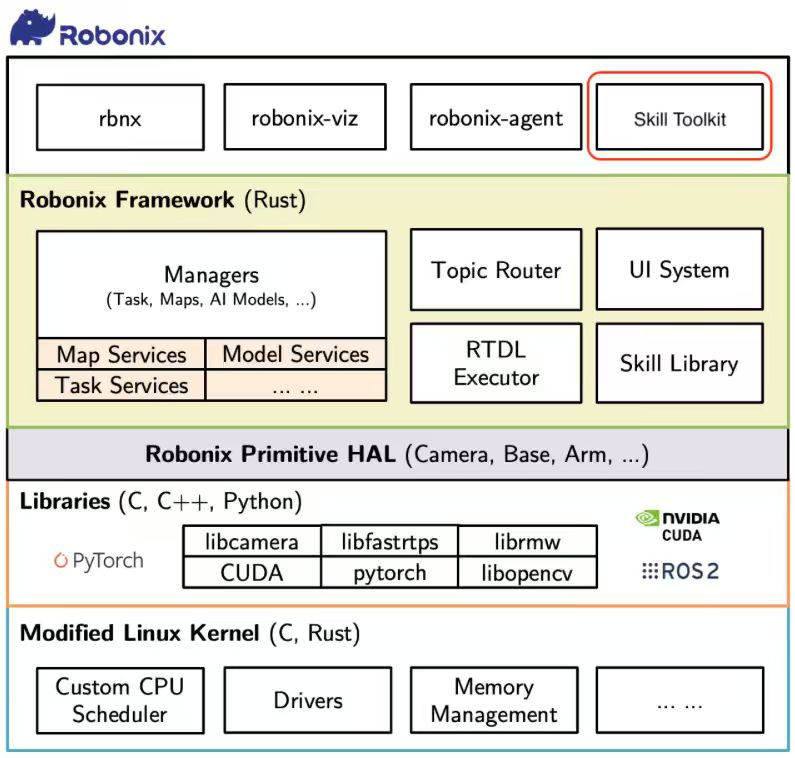

# Architecture and RoboNix Boundary

## Runtime Architecture


The current backend separates a dual-system VLN model into:

- **S2 cloud runtime** for semantic reasoning and latent generation;
- **S1 edge runtime** for current-observation action generation;
- **active/pending context buffer** for fresh and in-flight latents;
- **switching policy** for asynchronous or synchronized execution;
- **timeout policy** for bounded blocking and safe latent reuse;
- **telemetry path** for navigation and system metrics.

## Step Data Flow

1. The edge receives the latest observation.
2. The switching policy uses the current state and latent metadata to choose
   asynchronous reuse or a fresh-latent barrier.
3. S2 processes the observation and instruction on the cloud.
4. The response enters the pending buffer and becomes active at a safe boundary.
5. S1 combines the active semantic context with the latest edge observation and
   generates an action.
6. Runtime and navigation measurements are recorded for the step.

Late S2 responses are absorbed into the pending slot instead of stalling an
already completed edge step.

## Target RoboNix Workflow




The workflow figure is an integration target. This repository ships a
standalone HTTP Skill process with lifecycle operations:

```text
GET  /health
POST /setup
POST /reset
POST /step
POST /telemetry
POST /close
```

It does not ship or claim a RoboNix core Driver, capability manifest, Atlas
registration implementation, or modifications to Pilot/Executor.

## External Compatibility Boundaries

InternNav currently exposes APIs and output names that contain `edgecloud` or
`edge_cloud_s2`. These names remain at the adapter boundary:

- `internnav.edgecloud`
- `measure_edge_cloud_s2_runtime.py`
- `edge_cloud_s2_summary.json`
- `edge_cloud_s2_control_steps.csv`
- `edge_cloud_s2_episode_summary.csv`

They are upstream identifiers rather than the product name. Renaming them
inside this repository would break the real evaluation path.

## Protocol

The transport exchanges versioned latent request and response messages using
msgpack-compatible serialization. A response carries:

- semantic trajectory latent;
- optional pixel goal;
- S2 observation RGB/depth memory;
- optional initial diffusion latents;
- latency and adapter metadata.

Network security, identity, authorization, and production transport encryption
must be provided by the deployment environment.
